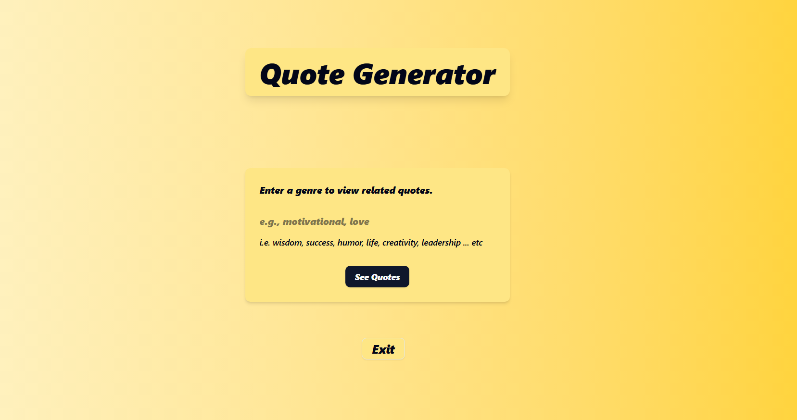
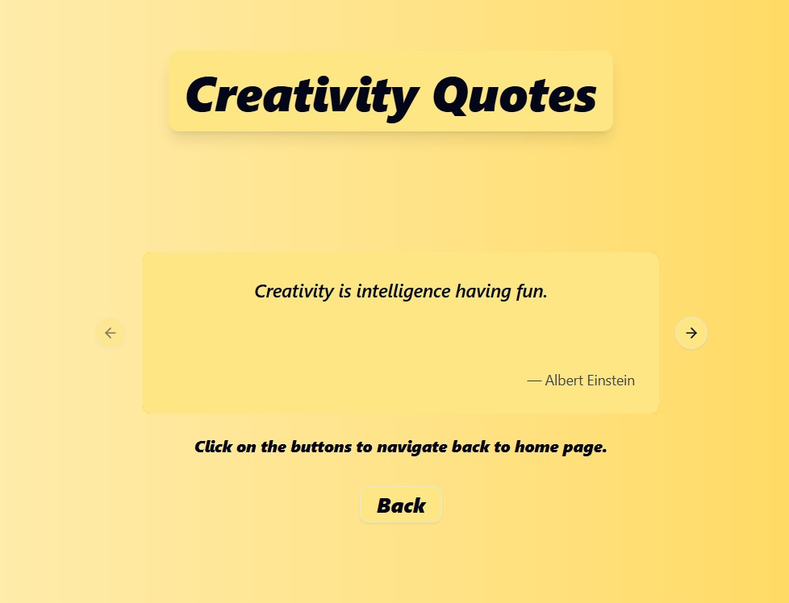

## Project Description
Quote Generator web is a simple [Next.js](https://nextjs.org) project integrated with [ShadCN_ui](https://ui.shadcn.com/).It contains two routes one the home page and other is quote page.The main functionality of the project is it displays the quotes according to the genre entered by the user.quotes are fetched from data/quotes file by matching the genre.If quotes are found they are displayed via carousel componenet if not then a sorry mesage appears for that particular genre.Styling of the web is done via tailwand css.

## Project Components 
Project include various files and folders.I have kept my app folder in the src(source) directory.It contains .next, node_modules, public, src directories and eslint.config, next.config, package-lock.json, package.json, postcss.config, tsconfig.json files, these all come when setting up the next js project while the components and lib directoriess and components.json come while setting up shadCN ui for the project. The data diectory contains the quotes.ts file where a the data(quotes) that are to be displayed are stored.

## SchadCN ui Components 

1.Button.tsx
As the name suggest this component is used to provide the button that can be used to perform different navigation functions.

2.Carousel.tsx
This is used to display different content on different carousel item and also provide functionality to navigate through previous and next content by using the button component

3.Form.tsx
Provides a reusable set of form components using react-hook-form and Radix UI, including: FormField, FormLabel, FormControl, FormMessage, etc. to streamline building accessible and well-structured forms with validation, messages, and consistent ARIA attributes.

4.Input.tsx
Has two primary sections:
Input Component – A reusable Tailwind CSS-styled input field.
InputForm Component – A form that:
Utilizes Zod for schema verification, Permits the user to enter a genre and Redirects to a new route /quote?genre=value when submitted. This is the primary user interface for quotes searching per genre.

5.Label.tsx
Defines a styled wrapper component around Radix UI’s Label primitive. It applies consistent styling and handles disabled state indicators. Used for labeling form fields in a more accessible and customizable way.

6.Sonner.tsx
Configures and exports an custom-styled toast notification system with the sonner library. It utilizes the theme from next-themes to apply the visual style depending on the current system or user theme.

## Home Page (i.e.src/app/page.tsx)
Here name of the application is displayed and transition is applied to it via motion component from frammer-motion. Then the input component of shadcn is imported which takes input with validation and on click(on see quotes) navigates to the quote route.
It also contain the Exit buttton impoted from button component of shadcn that is used to close the window if allowed by the browser.Styling is applied on the page using tailwand css.

## quote Page (i.e.src/app/quote/page.tsx)
It searches the name of genre and then displays that particular name with transition on screen using the motion component of framer-motion, then fetches the qotes of that particular genre in data/quotes file if quotes are available they are displayed via carousel component of shadcn if not than a sorry message is printed. It also has back button impoted from button component of shadcn used to navigate back to the home page.Styling is applied on the page using tailwand css.

## Running Images



## How To Run

First, run the development server:

```bash
npm run dev

Open [http://localhost:3000](http://localhost:3000) with your browser to see the result.

You can start editing the page by modifying `app/page.tsx`. The page auto-updates as you edit the file.

This project uses [`next/font`](https://nextjs.org/docs/app/building-your-application/optimizing/fonts) to automatically optimize and load [Geist](https://vercel.com/font), a new font family for Vercel..
```

## Ending 
This project is a part of my internship at NEXIUM.ltd. They provide a great assistance in building my first frontend project.
